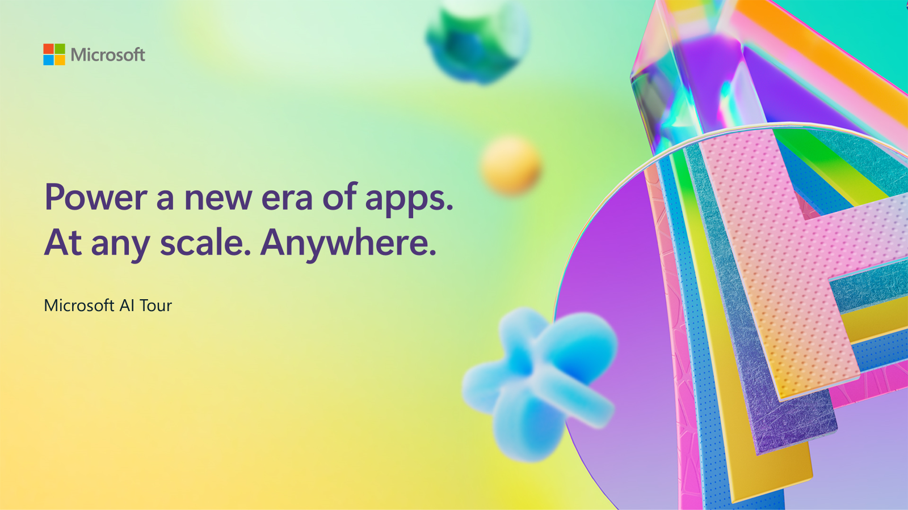
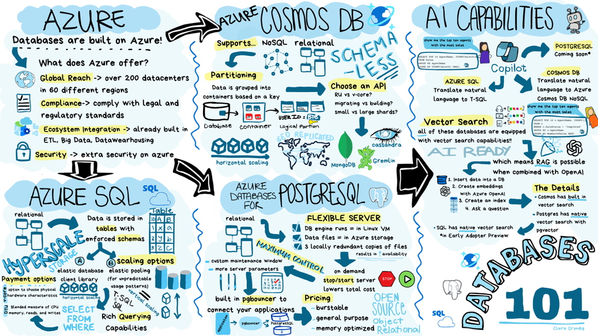

# Next gen AI apps with databases at scale anywhere

This repo is a companion to this session at Microsoft AI Tour, a worldwide tour of events.

> Learn more about Microsoft AI Tour on the official website.

## Session Description

Introducing a new era of cloud databases, an era where databases are built and tuned for AI apps with hyperscale performance, built-in intelligence, Copilot assistants, integrated vector database, and Azure AI Search integration to set the foundation for innovating with AI and make app development easy. Learn how to transform business apps with AI, extend your on-premises investments and modernize your workloads for growth.

## Learning Outcomes

- Understand how databases within the Microsoft Intelligent Data Platform empower developers to innovate with AI and make app development easy.

- Learn how each database within the Microsoft Intelligent Data Platform is AI Ready, with built-in intelligence, Copilot assistants, integrated vector database, and Azure AI Search integration.

- Learn how to build and deploy intelligent applications with Azure Cosmos DB, Azure SQL Database, and Azure Database for PostgreSQL.

## Technology Used

- Azure Cosmos DB for NoSQL
- Azure Database for PostgresSQL
- Azure SQL Database

## Additional Resources and Continued Learning

You can find additional resources, including the slides of the presentation, [here](./SESSION_RESOURCE.md).

If you will present this talk, you can find the [trainer resources here](./train-the-trainer/README.md). 

## Content Owners

<!-- ALL-CONTRIBUTORS-LIST:START - Do not remove or modify this section -->

<table>
<tr>
    <td align="center"><a href="http://learnanalytics.microsoft.com">
         
        <b>Jasmine Greenaway
</b></a> 
            <a href="https://github.com/paladique" title="talk">📢</a> 
    </td>
    <td align="center"><a href="http://learnanalytics.microsoft.com">
         
        <b>Ismaël Mejía
</b></a> 
            <a href="https://github.com/iemejia" title="talk">📢</a> 
    </td>
</tr>
</table>

<!-- ALL-CONTRIBUTORS-LIST:END -->

## Responsible AI
Microsoft is committed to helping our customers use our AI products responsibly, sharing our learnings, and building trust-based partnerships through tools like Transparency Notes and Impact Assessments. Many of these resources can be found at [https://aka.ms/RAI](https://aka.ms/RAI). Microsoft’s approach to responsible AI is grounded in our AI principles of fairness, reliability and safety, privacy and security, inclusiveness, transparency, and accountability.

Large-scale natural language, image, and speech models - like the ones used in this sample - can potentially behave in ways that are unfair, unreliable, or offensive, in turn causing harms. Please consult the [Azure OpenAI service Transparency note](https://learn.microsoft.com/legal/cognitive-services/openai/transparency-note?tabs=text) to be informed about risks and limitations.

The recommended approach to mitigating these risks is to include a safety system in your architecture that can detect and prevent harmful behavior. [Azure AI Content Safety](https://learn.microsoft.com/azure/ai-services/content-safety/overview) provides an independent layer of protection, able to detect harmful user-generated and AI-generated content in applications and services. Azure AI Content Safety includes text and image APIs that allow you to detect material that is harmful. Within Azure AI Studio, the Content Safety service allows you to view, explore and try out sample code for detecting harmful content across different modalities. The following [quickstart documentation](https://learn.microsoft.com/azure/ai-services/content-safety/quickstart-text?tabs=visual-studio%2Clinux&pivots=programming-language-rest) guides you through making requests to the service.

Another aspect to take into account is the overall application performance. With multi-modal and multi-models applications, we consider performance to mean that the system performs as you and your users expect, including not generating harmful outputs. It's important to assess the performance of your overall application using [Performance and Quality and Risk and Safety evaluators](https://learn.microsoft.com/azure/ai-studio/concepts/evaluation-metrics-built-in). You also have the ability to create and evaluate with [custom evaluators](https://learn.microsoft.com/azure/ai-studio/how-to/develop/evaluate-sdk#custom-evaluators).

You can evaluate your AI application in your development environment using the [Azure AI Evaluation SDK](https://microsoft.github.io/promptflow/index.html). Given either a test dataset or a target, your generative AI application generations are quantitatively measured with built-in evaluators or custom evaluators of your choice. To get started with the azure ai evaluation sdk to evaluate your system, you can follow the [quickstart guide](https://learn.microsoft.com/azure/ai-studio/how-to/develop/flow-evaluate-sdk). Once you execute an evaluation run, you can [visualize the results in Azure AI Studio](https://learn.microsoft.com/azure/ai-studio/how-to/evaluate-flow-results).
